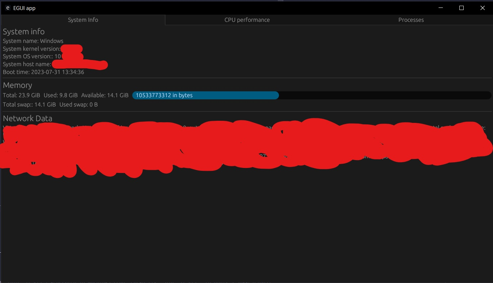
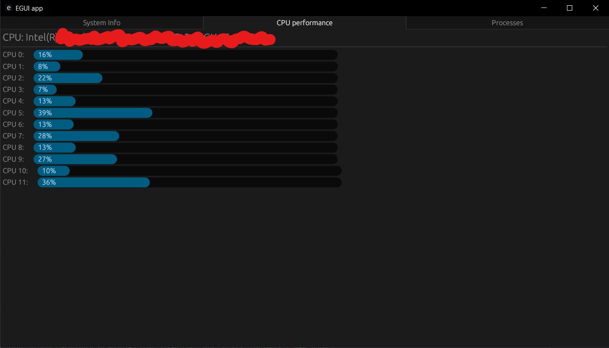
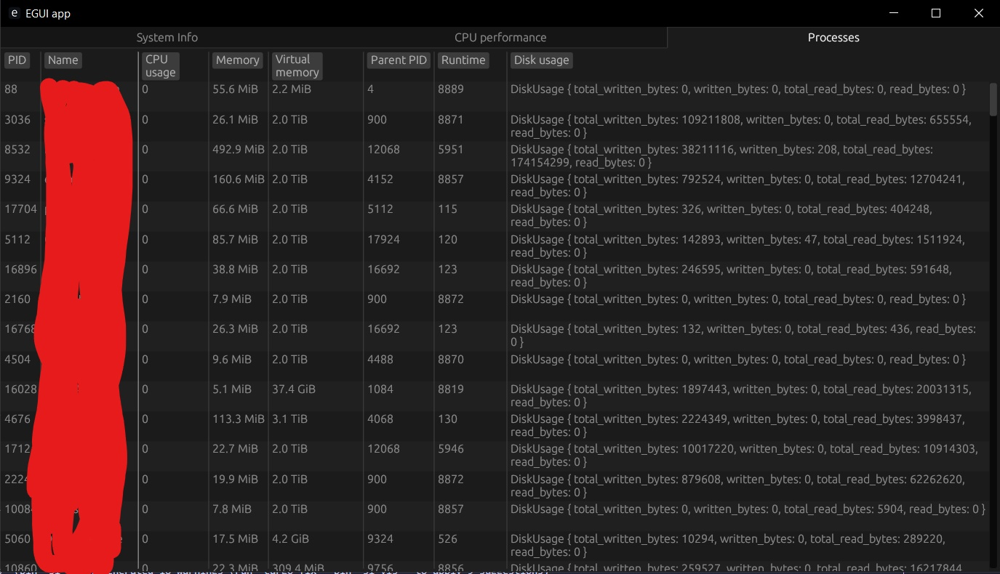

# System Info visualizer (si-vis)
Simple system info visualizer written in Rust for education purposes only.
## Dependency resolution
- [eframe](https://github.com/emilk/egui/tree/master/crates/eframe) - official framework library for writing apps using [egui](https://github.com/emilk/egui), GUI library for Rust
- [egui_dock](https://github.com/Adanos020/egui_dock) - library provides docking(tabs) support for `egui` 
- [egui_extras](https://docs.rs/egui_extras/latest/egui_extras/) - adds some features on top of `egui`, used for building table
- [sysinfo](https://github.com/GuillaumeGomez/sysinfo) - crate used to get a system's information
## Code organization
- `si_gui`, contains GUI app drawing and updating parts 
	- `si_data`, stores and updates system info data
## Screenshots
General system info tab

CPU and its usage info tab 

Processes info table tab

## Future plans
- Reorganize app layout
- Add sorting based on columns in processes info table
- Display memory allocation process in real-time when specific process is selected (inspired by [mevi](https://github.com/fasterthanlime/mevi))